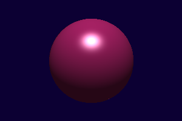

# LibRayMarching
The LibRayMarching is a library that implements ray marching and rendering by Phong Shading. It supports scene handling and implements several primitives as well as grouping.

### Primitives
The library supports following primitives
- Sphere
- Box
- Plane
- Capsuel
- Torus
- Quaternion Julia Fractal
- Menger Sponge

### Grouping
Primitives can be merged into groups. Therefore a group supports folling merging method
- Unify all primitives
- Intersect all primitives
- Take first primitives and subtract all following primitives

### Materials
The user can specify a material for a primitive. The material supports following material properties
- Color
- Ambient, Diffuse, Specular and SpecularAlpha for Phong Shading
- Reflection
- Transparency

### Language Bindings
The API is defined by and ACT xml. This allows powerfull binding generation for following languages
- C (dynamic and static)
- C++ (dynamic and static)
- Python3
- Pascal

### Python example
Following Python listing shows how to render a scene that contains a sphere
```python
import LibRayMarching
from PIL import Image
import math

Width = 300;
Height = 200;
# LibRayMarching. access
Wrapper = LibRayMarching.Wrapper("libraymarching");
Scene = Wrapper.CreateRayMarching();
Scene.SetScreenSize(Width, Height);
Scene.SetViewport(
	LibRayMarching.Vector(0, -6, 0),
	LibRayMarching.Vector(0, 1, 0),
	LibRayMarching.Vector(0, 0, 1), math.pi*20/180);
Scene.SetBackground(LibRayMarching.Vector(0.05, 0, 0.2), 30, 40);
Scene.AddLight(LibRayMarching.Vector(0, -20, 25), LibRayMarching.Vector(1, 1, 1));
Sphere = Wrapper.CreateSphere(1);
Sphere.SetMaterial(LibRayMarching.Material(
	Red = 0.5, Green = 0.1, Blue = 0.3,
	Ambient = 0.3,
	Diffuse = 1,
	Specular = 1,
	SpecularAlpha = 15));
Scene.AddPrimitive(Sphere);
Scene.RenderScene();
ColorBuffer = Scene.GetColorBuffer();

# Save image as png with PIL
Img = Image.new('RGB', (Width, Height))
Pixels = Img.load()
for i in range(Img.size[0]):    # for every col:
	for j in range(Img.size[1]):    # For every row
		color = ColorBuffer[i + j * Img.size[0]];		
		Pixels[i,j] = ((color >> 16) & 0xFF, (color >> 8) & 0xFF, color & 0xFF) # set the colour accordingly
Img.save('ray_marching.png')
Img.show()
```



### Demo

This youtube video demonstrates features of LibRayMarching v1

[](https://www.youtube.com/watch?v=yYpzFb8Q8nE)